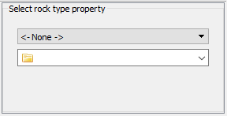

# LPM-Geomod_Suite
This is a geologic modeling suite plugins for AR2GEMS using signed distances functions and indicators.

## Installation
Paste the ui folder content to plugins\Geostat AR2GEMS folder and py folder content to plugins\Geostat\python AR2GEMS folder. helpers.py should go on Lib AR2GEMS folder.
If everything goes well you will see LPM-Geomod_Suite in the algorithms pannel.

## Transformations 
Tranformations are straightforward. User needs to select the categorical rock type property.

### Indicators
Creates one indicator property for each category.

### Signed distances
Creates one signed distances property for each property.

## Deterministic

### Transformations
There are transformations for the gridded properties too.

#### Softmax

#### Entropy

## Stochastic

## Validation

## Optimizationn

## What can be done?
